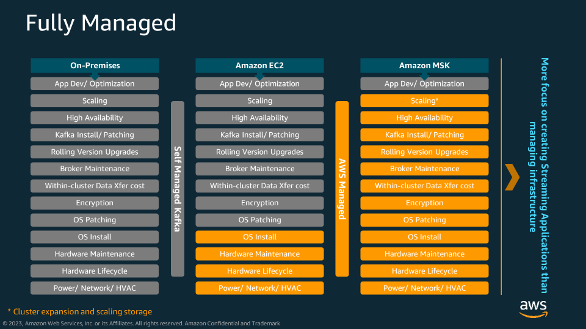
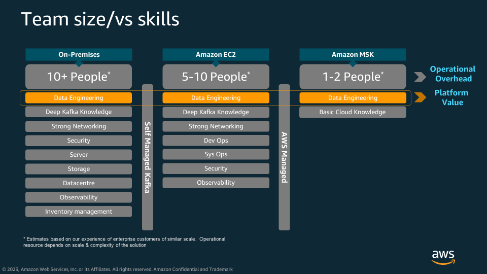
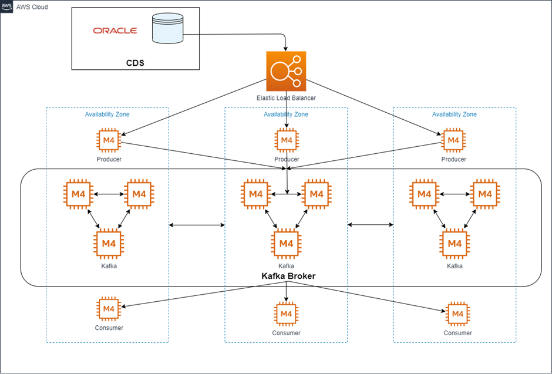
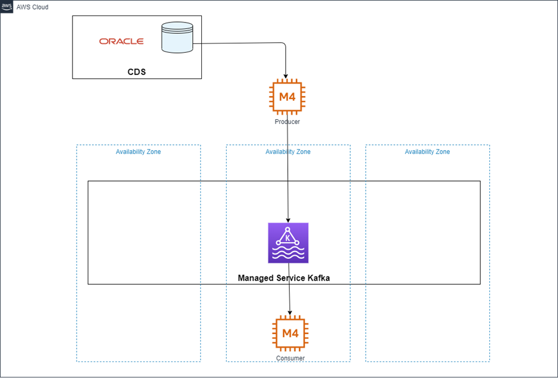

<h2> Comparison of self-managed Kafka on AWS EC2 vs AWS provisioned MSK </h2> 

In this upload we will provide a short overview of the implementation, operational and cost differences between running open-source Apache Kafka on AWS EC2 versus AWS Managed Streaming for Kafka (MSK).  There are two types of MSK, provisioned and serverless.  This upload only takes into consideration provisioned MSK.  A subsequent upload will provide details on Serverless MSK, now that it is [available](https://aws.amazon.com/about-aws/whats-new/2023/08/amazon-msk-serverless-additional-aws-regions/) in EU-WEST-2 region.

**What is Apache Kafka?**  Apache Kafka is a distributed event store and stream-processing platform. It is an open-source system developed by the Apache Software Foundation written in Java and Scala. Kafka allows applications to publish and subscribe to streams of records, store events in consistent order within partitions and allows applications to process records as they occur.

**What is AWS MSK?**  Amazon Managed Streaming for Apache Kafka (Amazon MSK) is a fully managed service that enables your organisation to build and run realtime Kafka data pipelines without the need to manage  infrastucture, OS or software patching.  MSK keeps costs low and is offered at as low as 1/13th the cost of other providers.

With the increase in Kafka adoption, organisations are asking themselves whether they should create and manage their own Kafka cluster using open-source Kafka or should they leverage AWS managed service MSK.  This upload will not be an exhaustive list of advantages versus disadvantages but will focus on highlighting areas that should be considered when deciding which approach should be adopted.  

Those areas are:

*	Team size
*	Implementation / architecture 
*	Cost

The difference between Kafka implemented on-premise v EC2 v MSK can be broken down as follows. The items highlighted in orange are functional deliverables that are provided through the AWS managed service model, and the grey items are deliverables that will be the responsibility of your delivery team.

As per the above, there is a significance difference between managed and self-managed solutions.  The additional time and effort for maintaining a self-managed platform is difficult to calculate but the following image provides a comparison break-down of the number of individuals and the types of skills required to build the different types of Kafka solutions.  

Note: The follow technical guidelines are based on a typical deployment of 500GB with 10MB/s throughput split between 3 AZ’s.  Estimates based on our experience of enterprise customers of similar scale.  Operational resource depends on scale and complexity of the solution. 

<h2> Running Apache Kafka on AWS EC2 (self-managed) </h2>

To build a self-managed Kafka platform, your organisation will need to provision the relevant EC2 instances, configure the network connectivity between the brokers within the AZ and across AZ, and install Kafka and Zookeeper on each of the nodes.  To build, deploy and support an enterprise self-managed Kafka environment of this nature your organisations will need a team of approx. 5 engineers with strong infrastructure and networking skills.  

Once the solution is deployed the types of tasks that an organisation’s support team needs to plan for are, but are not limited to; observability across instances, storage, networking, managing Kafka broker(s), replication of data ensuring data sync, security configuration (vpc, subnets and security groups), manage scaling and synchronisation across the cluster, manage failures, patching software and maintaining uptime.

Open-source Kafka is free to download however the cost of managing the Kafka cluster is much higher than MSK due to the complexity of Kafka.

Below illustrates what a self-managed Kafka architecture would typically reflect.  Information is being generated from a relational database and submitted to a Kafka producer which commits the events to the Kafka cluster.  There is a three broker cluster in each AZ which communicates with the other AZ's for data replication/durability and high availabilty;

<h2> Running Apache Kafka on AWS Managed Streaming for Kafka (Managed Service) </h2>

Amazon MSK operates, maintains and scales Apache Kafka clusters, provides enterprise-grade security features and has built-in AWS integrations that accelerate development of streaming data applications, out of the box.  Your organisation can benefit from the value of Kafka without the need to become experts in operating Apache Kafka.  Your organisation has the ability to benefit from AWS Identity Management (IAM) to protect and control access to your MSK cluster.  Your organisation can also publish topics publiclly via certificates to share information with 3rd parties.  

You can create your cluster with a few clicks in the AWS management console or using the AWS SDKs.  

Because MSK is a managed service, your organisation will need a much smaller team to deploy, manage and support MSK, in most cases this can between 1-2 engineers (depending on size).

A point to consider is that MSK is managed by the AWS MSK services team therefore your MSK cluster will be deployed in a MSK service team VPC.  MSK resources will be available to your own Amazon VPC, subnet, and security group you select when the cluster is setup

Compared to self-managed solutions, managed MSK solutions are up to 60% lower in cost.  This is due the efficient use of infrastructure through the managed service.  Furthermore, your organisation will benefit significantly from the reduction in effort required to deploy and maintain the platform once in production.  

MSK tiered storage capability with storage auto scaling allows virtually unlimited storage.

This illustration of a MSK managed platform, when compared to the previous solution, demonstrates a much simpler solution with a lot less dependencies to manage.  MSK by default deploys into three AZ's and deliveres a 99.99% availability SLA.  

The conclusion of this is that MSK is a much easier, safer and cost-effective way to deliver Kafka into your organisation.  For more information on AWS MSK see [here](https://aws.amazon.com/msk/).

